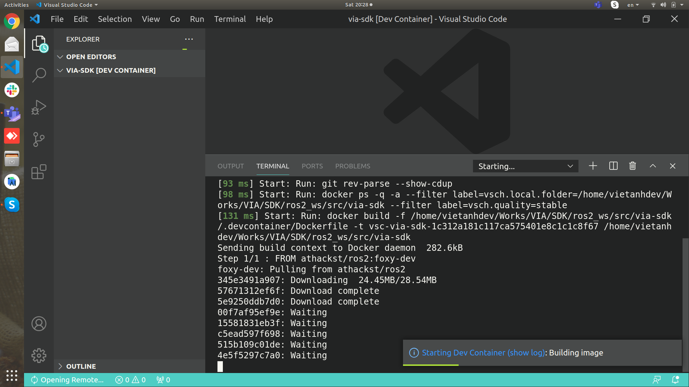

# VIA SDK - ROS2-based architecture for autonomous robots

VIA project: <https://via.makerviet.org/>.

[](https://youtu.be/d1vy-Sd1LJE)

## I. Setup development environment

### 1. Native development

**Requirements**

- Ubuntu 20.04
- ROS 2 Foxy
- camera_info_manager
- image_transport

### 2. Using Docker

**Requirements**

- Visual Studio Code
- ROS 2: Foxy/Dashing
- Docker

**Step 1: Clone source code and Open in container - VS Code**


**Step 2: Wait for Docker pull and start your contributions**



**ROS 2 Cheatsheet:** <https://github.com/ubuntu-robotics/ros2_cheats_sheet>.

## II. Demo

## 1. VIA Simulation Autopilot

This demo shows how to run VIA Autonomous to control a self-driving car in simulation environment.

- Download the Simulation [here](https://github.com/makerhanoi/via-simulation-jeep/releases/tag/v0.2) - Only Linux suppported for now, you can clone the [source code](https://github.com/makerhanoi/via-simulation-jeep) and build your simulation for other OSes.

- Run the simulation and select a map.

- Build all packages

```
sh scripts/build.sh
source install/setup.bash
```

- Run autonomous stack

```
ros2 launch via_bringup via_car_simulation.py
```

## 2. Camera node demo

This demo shows you how to use VIA `generic_camera_node` to capture images from a camera and publish them to a ROS topic.

- Build all packages

```
sh scripts/build.sh
source install/setup.bash
```

- Launch camera node

```
ros2 launch generic_camera_node camera_node.launch.py
```

- Start camera stream

```
ros2 service call /camera/start std_srvs/srv/Trigger "{}"
```

- Open image viewer to see the published images

```
ros2 run rqt_image_view rqt_image_view
```

- Stop camera stream

```
ros2 service call /camera/stop std_srvs/srv/Trigger "{}"
```

## III. Issues

### 1. No ROS node name when using `ros2 node list`:

Restart ROS 2 deamon:

```
bash scripts/restart_ros2_deamon.sh
```

### 2. Missing ROS 2 packages?

Please ensure that you have built the project with `sh scripts/build.sh` and sourced the installation environment:

```
source install/setup.bash
```
## IV. Contact

This project is co-developed by VIA & AIR.
+ VIA Team: makerhanoi@gmail.com
+ AIR Team: air.team.2050@gmail.com
